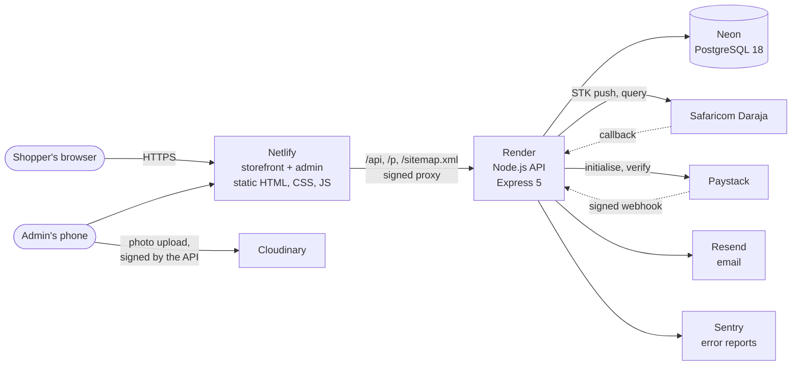

# NURA

A fashion shop for Kenya, built as a complete store: catalogue, accounts, cart, checkout with
**M-Pesa**, **cards** and **cash on delivery**, order emails, and an admin with two-factor
sign-in. Payments run in test mode.

**Live:** [nurafashion.netlify.app](https://nurafashion.netlify.app) · **API:**
[nura-api-w1nm.onrender.com/api/products](https://nura-api-w1nm.onrender.com/api/products) ·
**How it was built:** [the case study](docs/case-study.md) · **Security:** [SECURITY.md](SECURITY.md)

> The first visit after a quiet spell can take up to a minute: the API runs on a free plan that
> sleeps. The storefront shows placeholders and keeps retrying until it is awake.

## What it does

**For shoppers**

- 21 products across women, men, new in and sale, with search, filters, sizes and live stock.
- A page for every product, rendered on the server, so a link shared on WhatsApp shows the
  photo, name and price. Each page suggests four similar products.
- Accounts (or none: guests can do everything), a cart that follows you between devices,
  a wishlist, order history, saved delivery details, change password, delete account.
- Checkout with **M-Pesa** (an STK prompt on the phone), **card** (Paystack's hosted page) or
  **cash on delivery** in Nairobi. A 15-minute window to pay; stock is held meanwhile.
- Emails at every step (received, confirmed, shipped, delivered, cancelled, refunds), and a
  newsletter with double opt-in.

**For the shop owner**

- An admin with **password + authenticator code**, built for a phone: today's orders, what to
  pack, low stock, takings.
- Orders move only along allowed steps (confirm → pack → ship → deliver; cash collected),
  each one audited and emailed to the customer.
- Products: add with a photo (uploaded straight to Cloudinary), set the crop, prices, sale,
  stock per size and a description; hide and show.
- Payments that arrive for the wrong amount are held, and the owner is emailed at once to
  accept them or refund them.
- Customers and a newsletter export. A **read-only demo admin** sees everything with names,
  phones and addresses masked, and can change nothing.

## How it fits together



The browser only ever talks to one address: Netlify serves the pages and passes `/api` through
to Render, so cookies are first-party and there is no CORS. Netlify signs each request it
forwards, so the API can trust the shopper's real IP for rate limits.

## Built with

| Part | Choice | Why |
|---|---|---|
| Storefront | HTML, CSS and plain JavaScript | It started as a static site; every page still works as one, and nothing needs a build step |
| API | Node.js 22, Express 5, Zod 4 | Small, explicit, and every request body is checked against a strict schema |
| Database | PostgreSQL 18 on Neon, Drizzle ORM | Constraints, transactions and row locks carry the payment rules; migrations are plain SQL in the repo |
| Payments | Safaricom Daraja (M-Pesa STK push), Paystack | How Kenyans pay: M-Pesa first, cards second |
| Email | Resend | |
| Photos | Cloudinary | Any size on request from the address, so phones download small photos |
| Hosting | Netlify (static), Render (API) | Free plans; the cost of that is designed around (see the case study) |
| Monitoring | Sentry, UptimeRobot | |
| Tests and CI | Vitest, Supertest, GitHub Actions, gitleaks, Dependabot | 441 tests on every push, plus a dependency audit and a secret scan of the whole history |

## The repository

```
frontend/        The site Netlify publishes: pages, styles, scripts, the admin (frontend/admin/)
  _headers       Security headers, including the enforced Content-Security-Policy
api/             The API Render runs
  src/           routes/ (HTTP) · services/ (business rules) · db/ (schema, seed) · lib/ · middleware/
  drizzle/       SQL migrations, in order
  test/          441 tests, run against a real PostgreSQL
  ops/           Production runbooks and scripts: moving the database, migrations, the live security probe
tools/           photo-sizes.py: the 400/800/1200 px copies of the product photos
netlify.toml     The proxy to the API, and "only build when the storefront changes"
SECURITY.md      What is protected, how each protection was attacked, what is accepted
```

## Running it

The API's own [README](api/README.md) has the full setup: environment variables, migrations,
the seed, every endpoint, and how each outside service is configured. In short:

```bash
cd api
npm ci
cp .env.example .env     # a PostgreSQL connection string is all it needs to start
npm run db:migrate && npm run db:seed
npm test
npm run dev              # the API on http://localhost:3000
python ../server.py      # the storefront on http://localhost:8000, with /api passed through
```

Without payment, email or photo keys, those features switch off cleanly: emails are printed in
the terminal, and checkout offers cash on delivery only.

## Status

Finished as a portfolio project (October 2026). To take real money it would need Paystack live
mode and Safaricom production access (both need a registered business), a domain of its own
for email, and paid hosting plans: see the end of the case study.
